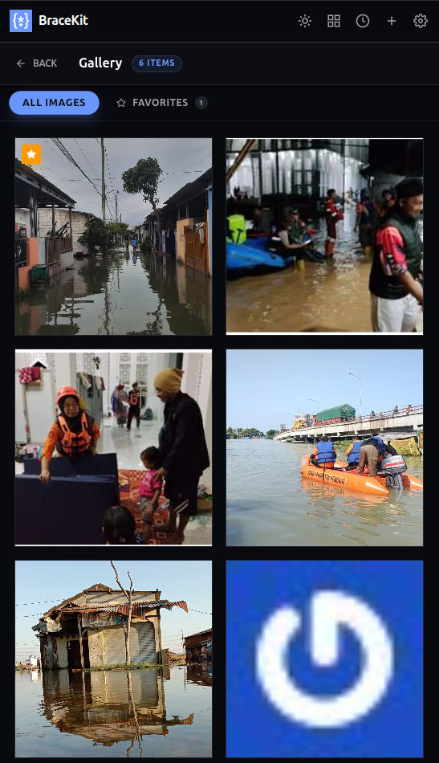
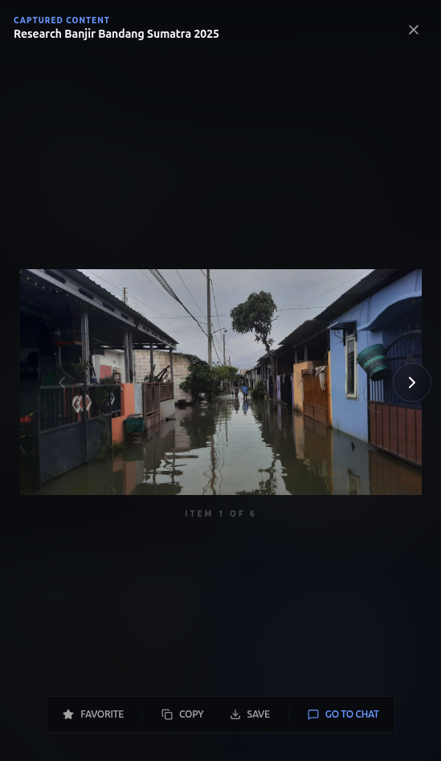

+++
title = "Gallery View"
description = "Browse all generated and attached images across conversations."
weight = 45
template = "page.html"

[extra]
category = "Advanced"
+++

# Gallery View

The Gallery is your central hub for all images in BraceKit — both generated by AI and attached by you.

## Opening the Gallery

Click the **grid icon** in the header to open the Gallery view.

## Image Sources

The Gallery collects images from:

| Source | Description |
|--------|-------------|
| **Generated** | Images created by AI (Gemini, xAI) |
| **Attached** | Images you uploaded |
| **Markdown** | Images rendered from markdown |

## Filtering

Use the tabs at the top to filter:

- **All Images** — Show all images from all sources
- **☆ Favorites** — Show only favorited images

## Image Actions

### View Full Size

Click any image to open the lightbox:
- Full resolution
- Navigation arrows
- Keyboard shortcuts (← →)

### Favorite

Click the **star icon** to favorite:
- Favorites show a star indicator
- Quickly find important images
- Filter by favorites

### Copy

1. Open image in lightbox
2. Click **Copy** button
3. Image copied to clipboard

### Save

1. Open image in lightbox
2. Click **Save** button
3. Save to your computer

### Jump to Conversation

1. Open image in lightbox
2. Click **Go to Chat**
3. Navigate to the source chat

## Lightbox Controls

When viewing an image full-size:

| Control | Action |
|---------|--------|
| **← →** | Navigate images |
| **☆** | Toggle favorite |
| **Copy** | Copy to clipboard |
| **Save** | Save to disk |
| **Go to Chat** | Jump to conversation |
| **X** or **Esc** | Close lightbox |

## Image Information

### In Gallery Grid

Hover over an image to see:
- Conversation title
- Favorite indicator (if favorited)

### In Lightbox

When viewing full-size:
- Conversation title (top left)
- Item counter (bottom: "Item X of Y")
- Available actions

## Storage

### Where Images Are Stored

Images are stored in:
- **IndexedDB** — Local browser database
- **Never uploaded** to external servers
- **Persist across sessions**

### Storage Limits

IndexedDB has practical limits:
- Depends on available disk space
- Browser manages cleanup
- Very large collections may slow down

### Managing Storage

To free up space:
1. Delete old conversations
2. Remove unfavorited images
3. Clear browser data (removes all)

## Organizing Images

### Favorites

Use favorites to mark:
- Best generated images
- Important screenshots
- Reference images

### By Conversation

Images are grouped by conversation:
- Click "Go to Chat" to see context
- Delete conversation to remove its images

## Tips

### Finding Images

- Use favorites for quick access
- Check the conversation title on hover
- Use keyboard arrows in lightbox to browse

### Sharing Images

1. Open in lightbox
2. Copy to clipboard
3. Paste in any application

### Preserving Images

- Favorite important images
- Download copies for backup
- Don't rely solely on Gallery storage

## Troubleshooting

### Images not appearing

- Check if conversation was deleted
- Verify images were generated successfully
- Refresh the Gallery view

### Gallery loading slowly

- Large collection of images
- Clear old, unfavorited images
- Check available disk space

### Images missing after update

- Storage should persist
- Check browser storage settings
- May need to regenerate

## Related

- [Image Generation](/guide/advanced/image-generation/) — Create images
- [File Attachments](/guide/core-features/attachments/) — Upload images
- [Chat Interface](/guide/core-features/chat/) — View images in chat
