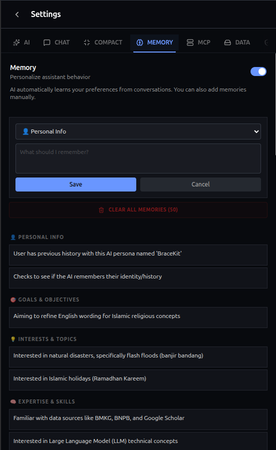

+++
title = "Memory System"
description = "Let BraceKit remember your preferences across conversations."
weight = 42
template = "page.html"

[extra]
category = "Advanced"
+++

# Memory System

The memory system allows BraceKit to remember information about you across conversations. Instead of repeating your preferences every time, the AI remembers and applies them automatically.

## How It Works

1. **Enable memory** in Settings
2. **Chat normally** — BraceKit extracts important information
3. **Future conversations** include relevant memories as context

When you start a new conversation, BraceKit selects relevant memories and includes them in the AI's context, allowing personalized responses based on what it knows about you.

## Setup

### Enable Memory

1. Open **Settings**
2. Find **Memory** section
3. Toggle the memory system on



## Memory Categories

BraceKit organizes memories into categories:

| Category | Examples |
|----------|----------|
| **Personal** | Name, location, job title |
| **Goals** | Learning objectives, project goals |
| **Interests** | Hobbies, favorite topics |
| **Expertise** | Skills, experience level |
| **Preferences** | Coding style, response format |
| **Style** | Communication preferences |
| **Habits** | Work patterns, routines |
| **Context** | Current projects, tools used |
| **Dislikes** | Things to avoid |

## Managing Memories

### Viewing Memories

In **Settings → Memory**, memories are displayed grouped by category. You can:

- View all stored memories organized by category
- Edit any memory by clicking the pencil icon
- Delete individual memories

### Adding Memories Manually

1. Click **Add Memory**
2. Select a category from the dropdown
3. Enter the information
4. Click **Save**

Manual memories are stored with high confidence and prioritized in selection.

### Clearing All Memories

To delete all memories at once:

1. Go to **Settings → Memory**
2. Click **Clear All Memories**
3. Confirm the action

## How Memories Are Used

### Automatic Extraction

After conversations, BraceKit analyzes recent messages to extract new insights about you:

- Analyzes the last 8 messages
- Extracts new, non-duplicate information
- Only stores insights with high confidence (≥0.6)
- Maximum of 100 memories stored

### Memory Selection

When starting a conversation:

1. Memories are sampled using weighted random selection
2. Selection prioritizes confidence and recency
3. Up to 15 memories are included per conversation
4. Selection is balanced across categories for diversity

### Example

**Stored Memories:**
- You prefer TypeScript over JavaScript
- You work on React projects
- You like concise explanations

**Your Message:**
```
How do I fetch data in React?
```

**AI Response (with memory context):**
~~~md
Here's how to fetch data in React using TypeScript:

```typescript
// Using useEffect with fetch
useEffect(() => {
  fetch('/api/data')
    .then(res => res.json())
    .then(setData);
}, []);
```

For production, consider using React Query or SWR...
~~~

## Privacy

### Local Storage

All memories are stored locally:
- In Chrome's extension storage
- Never sent to external servers
- Only you can access them

### What Gets Remembered

BraceKit extracts:
- Stated preferences
- Personal information you share
- Goals and interests
- Professional context

### What Doesn't Get Remembered

- Sensitive data (passwords, API keys)
- Temporary information
- Information marked as confidential

## Best Practices

### Be Explicit

Share preferences clearly:
```
I prefer functional components over class components.
Please use TypeScript in code examples.
Keep explanations brief.
```

### Correct Mistakes

If the AI remembers something wrong, you can:
- Edit the memory directly in Settings
- Delete the incorrect memory
- Correct it in conversation (the system will update)

### Review Periodically

Check **Settings → Memory** occasionally to:
- Remove outdated information
- Correct errors
- Add important details manually

## Troubleshooting

### Memories not being extracted

- Ensure memory is enabled
- Conversations need substantive content
- Information must meet confidence threshold (≥0.6)
- Memory limit (100) may be reached

### Wrong memories being used

- Edit or delete incorrect memories in Settings
- Correct the AI in conversation to update memories

### Too many memories

- Clear old, outdated memories
- The system auto-manages by confidence and recency

## Related

- [Auto-Compact](/guide/advanced/auto-compact/) — Managing long conversations
- [Security](/guide/advanced/security/) — Protecting your data
- [Configuration](/guide/reference/configuration/) — All settings
