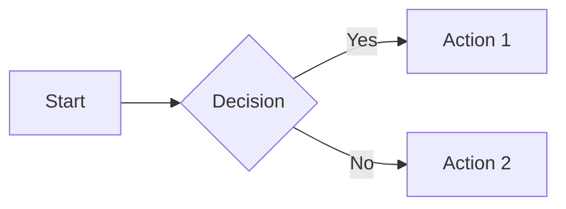
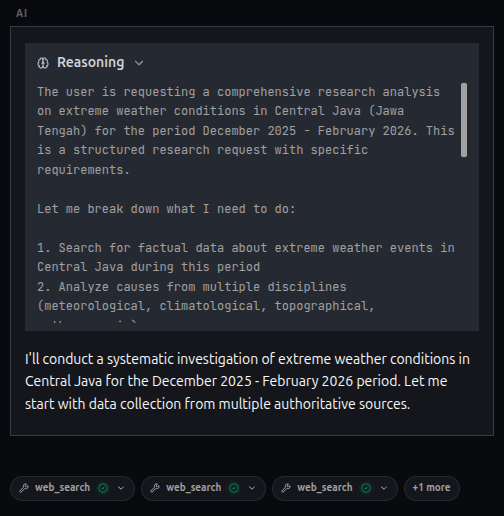
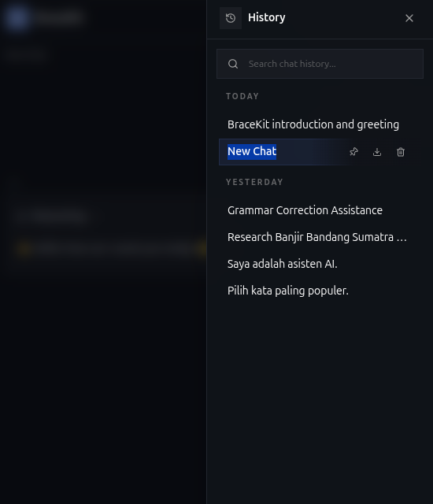
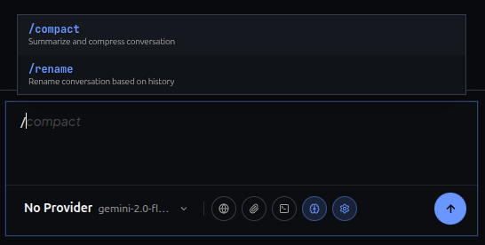
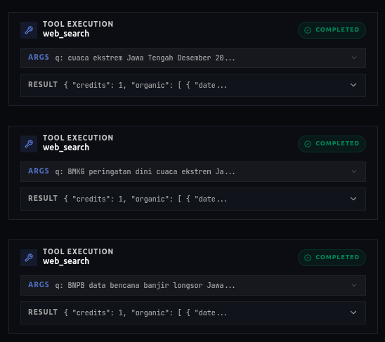
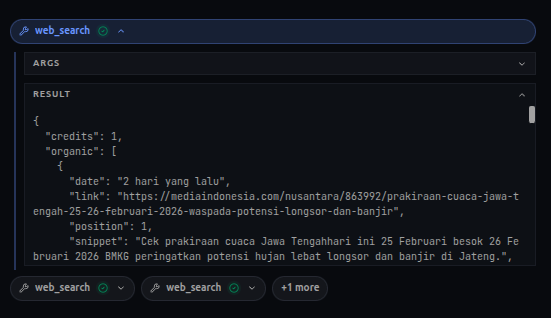

+++
title = "Chat Interface"
description = "Master the BraceKit chat interface with markdown, code blocks, and message actions."
weight = 21
template = "page.html"

[extra]
category = "Core Features"
+++

# Chat Interface

The BraceKit chat interface is designed for clarity and productivity. Here's everything you can do.

## Message Types

### Text Messages

Full markdown rendering with support for:

- **Bold**, *italic*, and `inline code`
- [Links](https://example.com)
- Lists (ordered and unordered)
- Blockquotes
- Headers

### Code Blocks

Code blocks include syntax highlighting and a copy button:

````markdown
```javascript
function greet(name) {
  return `Hello, ${name}!`;
}
```
````

Hover over a code block to see:
- **Copy** button (copies to clipboard)
- **Language** indicator

### Tables

Tables are rendered with proper formatting:

| Column 1 | Column 2 |
|----------|----------|
| Data 1   | Data 2   |

Table actions (hover to reveal):
- Copy as Markdown
- Copy as CSV
- Download CSV
- Fullscreen view

### Mermaid Diagrams

Mermaid diagrams are rendered inline:

````markdown

````

## Streaming Responses

By default, responses stream token-by-token in real-time:

1. Type your message and press Enter
2. Watch the response appear character by character
3. Markdown renders as it streams

### Stop Streaming

To stop a streaming response, click the **stop button** (square icon) that appears in place of the send button during streaming.

## Reasoning / Extended Thinking

For models that support extended thinking (Claude, DeepSeek R1, Gemini thinking, Ollama think mode), BraceKit displays the reasoning process in a collapsible section:



Click the header to expand/collapse the reasoning section.

### Enabling Reasoning Mode

1. Click the brain icon (🧠) in the toolbar
2. Send your message
3. The model will show its thinking process

> **Note:** Reasoning mode only works with supported models (Claude with thinking, DeepSeek R1, Gemini thinking models, Ollama with think mode).

## Message Actions

### For User Messages

Hover over your messages to see:

| Action | Description |
|--------|-------------|
| **Copy** | Copy the message content |
| **Edit** | Modify the message and resubmit |
| **Regenerate** | Get a different response from this point |
| **Branch** | Create a new conversation from this point |

When you edit a message:
1. The message becomes editable
2. Make your changes
3. Press Enter to resubmit
4. All subsequent messages are removed
5. A new response is generated

### For Assistant Messages

| Action | Description |
|--------|-------------|
| **Copy** | Copy the entire response |
| **Branch** | Create a new conversation from this point |

### Quoting Text

1. Select any text within a message
2. A quote button appears
3. Click to add the quote to your input as a markdown blockquote

## Conversation Management

### Starting a New Chat

Click the **+** button in the header to start a fresh conversation. Your current conversation is automatically saved.

### Conversation History

Click the **history icon** in the header to:
- View all past conversations
- Search by title or content
- Pin important conversations
- Delete old conversations
- Export as Markdown



### Auto-Generated Titles

After the first exchange, BraceKit automatically generates a title for your conversation based on the content. You can:

- Double-click to rename manually
- Type `/rename` to regenerate automatically

## Slash Commands

Type `/` in the input area to see available commands:

| Command | Description |
|---------|-------------|
| `/compact` | Summarize and compress conversation history |
| `/rename` | Generate a new conversation title |

Commands execute immediately when you press Enter.



## Context Window Indicator

When auto-compact is enabled and you're within 15% of the threshold, a warning appears above the input area:

- **≤15% remaining**: Gray indicator
- **≤10% remaining**: Yellow warning
- **≤5% remaining**: Red pulsing warning

Hover over the indicator to see exact token usage.

See [Auto-Compact](/guide/advanced/auto-compact/) for details.

## Tool Calls

When the AI uses tools (MCP or built-in), you'll see:

### Detailed Tool Calls


### Compacted Tool Calls


The display format depends on your preferences setting:
- **Detailed**: Full tool arguments and results
- **Compact**: Minimal display, just tool name and status

## Images in Chat

### Viewing Images

When the AI generates an image or you attach one:

1. Images appear inline in the conversation
2. Click to open in a lightbox
3. In lightbox: navigate with arrows, copy, download

### Generated Images

Images created by AI (Gemini, xAI) are:
- Saved to local IndexedDB storage
- Available in the [Gallery view](/guide/advanced/gallery/)
- Can be favorited for quick access

## Related

- [Auto-Compact](/guide/advanced/auto-compact/) — Managing context limits
- [Image Generation](/guide/advanced/image-generation/) — Creating images
- [Branching](/guide/core-features/branching/) — Creating conversation branches
