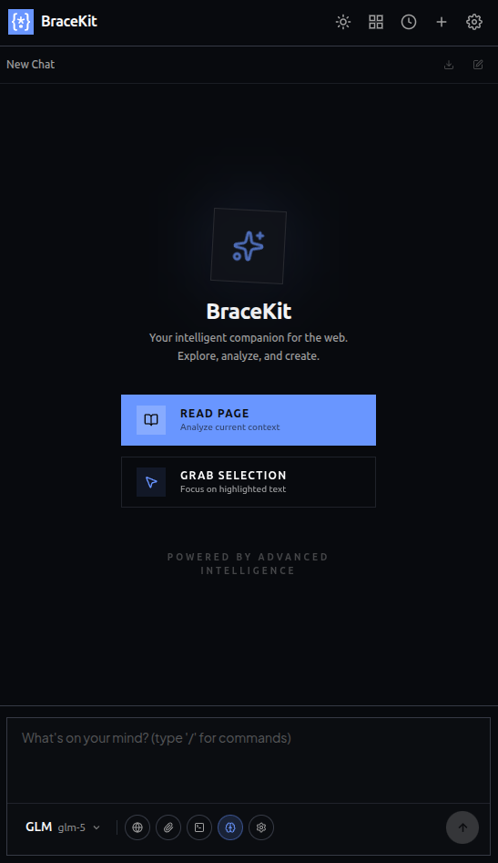

+++
title = "First Chat"
description = "Send your first message and learn the basics of BraceKit."
weight = 12
template = "page.html"

[extra]
category = "Getting Started"
icon = "<svg width='24' height='24' viewBox='0 0 24 24' fill='none' stroke='currentColor' stroke-width='2'><path d='M21 15a2 2 0 0 1-2 2H7l-4 4V5a2 2 0 0 1 2-2h14a2 2 0 0 1 2 2z'/></svg>"
+++

# Your First Chat

Now that BraceKit is installed, let's send your first message and explore the interface.

## Opening the Sidebar

Click the BraceKit icon in your Chrome toolbar. The sidebar will slide open from the right side of your browser window.

### Sidebar Layout



## Sending Your First Message

1. **Select a provider**: Click the provider button in the toolbar (e.g., "OpenAI ▾")
2. **Choose a model**: Select from available models
3. **Type your message**: Click the input area and type
4. **Send**: Press Enter or click the Send button

The AI response will stream in real-time, token by token.

### Example Conversation

~~~md
You: What is async/await in JavaScript?

BraceKit: Async/await is syntactic sugar over JavaScript Promises
that lets you write asynchronous code in a synchronous style...

The `async` keyword marks a function as asynchronous, and `await`
pauses execution until a Promise resolves.

```javascript
async function fetchData() {
  const response = await fetch('/api/data');
  const data = await response.json();
  return data;
}
```
~~~

## Using Page Context

BraceKit can read the content of your current webpage:

1. Navigate to any article or documentation page
2. Open the sidebar
3. Click the **globe icon** (🌐) in the toolbar
4. The page content is now attached to your message
5. Ask questions about the page

```
You: Summarize the key points of this article

BraceKit: Based on the article you're viewing, here are the key points:

1. The article discusses...
2. It emphasizes...
3. The conclusion suggests...
```

## Working with Selected Text

Select any text on a webpage to ask questions about it:

1. Highlight text on any webpage
2. Open the sidebar
3. The selected text appears as an attachment
4. Ask your question

You can also right-click selected text and choose **"Send to BraceKit"** from the context menu.

## The Toolbar

The input toolbar contains quick actions:

| Icon | Action | Description |
|------|--------|-------------|
| 🌐 | Page Context | Attach current page content |
| 📎 | Attach File | Add images, text files, or PDFs |
| 💻 | System Prompt | Edit the system prompt |
| 🧠 | Reasoning Mode | Enable extended thinking (Claude) |
| ⚙️ | Settings | Open settings panel |

## Slash Commands

Type `/` in the input area for quick commands:

| Command | Description |
|---------|-------------|
| `/compact` | Summarize and compress the conversation |
| `/rename` | Auto-generate a conversation title |

## Message Actions

Hover over any message to see available actions:

### User Messages
- **Edit**: Modify your message and resubmit
- **Quote**: Select text to quote in a new message

### Assistant Messages
- **Copy**: Copy the entire response
- **Branch**: Create a new conversation from this point
- **Regenerate**: Get a new response

## Next Steps

Now that you've sent your first message, explore these features:

- **[Page Context](/guide/core-features/page-context/)** — Deep dive into page reading
- **[Text Selection](/guide/core-features/text-selection/)** — Work with selected text
- **[Branching](/guide/core-features/branching/)** — Explore conversation alternatives
- **[AI Providers](/guide/ai-providers/)** — Set up additional providers
